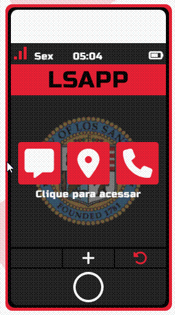
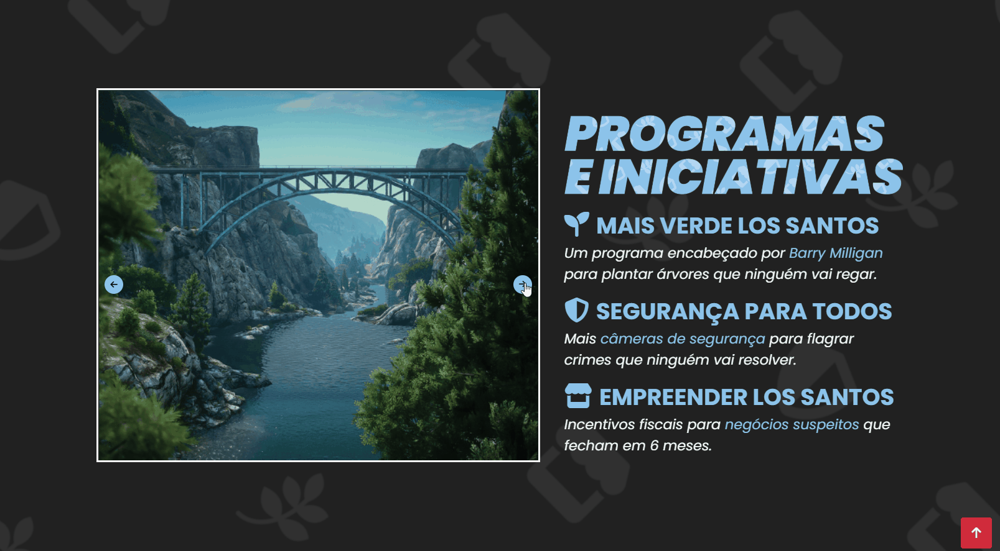

# Prefeitura de Los Santos | Landing Page
### Acesse todos os serviços disponíveis no portal oficial da cidade de Los Santos, como informações de contato, dados tributários e programas beneficente.

---
1 - Home: Seção inicial com título, subtítulo e seta animada (arrowDown).

2 - Mobile: Título e anúncio do patrocinador. Fornece informações sobre o aplicativo mobile, possibilitando acesso ao portal da cidade pelo celular. Inclui uma composição de um celular feita com JavaScript que mostra informações ao clicar nos ícones.

3 - Programs: Fornece informações sobre programas e iniciativas realizadas na cidade. Inclui um slider (carrossel) mostrando imagens que ilustram esses programas.

4 - Serviços Online: Mostra todas as informações possíveis de serem consultadas no portal, como: informações tributárias, emissão de documentos e uma área de feedback.

5 - Guia da Cidade: Contém informações sobre pontos turísticos e gastronomia. Inclui um slider (carrossel) mostrando imagens que ilustram os pontos turísticos.

6 - Footer: Informações adicionais, isenção de responsabilidade e acesso a mídias sociais.

---

---

# Processo

## 1 - Design
### Design e layout feito usando pacote Adobe 

- Obter referências e layout.

- Escolher tema e obter assets.

- Escolher cores.

## 2 - Planejamento

- Fazer desenho de caixas (grid-flex) antes de escrever qualquer código, definindo quais elementos/tags serão usadas.

## 3 - Código

- ## Arrow Down (Home Section)
    - #### Foi implementada uma ArrowDown com animação de bounce usando CSS puro

---

    .arrow {
        animation: bouncing 1s infinite ease-in-out;
    }

    @keyframes bouncing {
    
        0% {
            bottom: 0;
        }

        50% {
            bottom: 30px;
        }

        100% {
            bottom: 0;
        }
    }

---

- ## Celular Interativo (Mobile Section) 
    - #### Foi implementado um sistema de popup de mensagens ao clicar nos ícones presentes no celular. Dentro dessa mensagem, há um botão para fechar a notificação e voltar para a página inicial.
    
---
#### 1 - Cria um EventListener em um dos botões (ícones do celular) e ativa uma função que abre (torna visível) a caixa com texto que estava escondida.

        #notification-box-chat {
            visibility: hidden;
            }
        
        document.querySelector("#appBtnChat").addEventListener("click", function () { 
            document.querySelector("#notification-box-chat").stylevisibility = "visible";
        });

#### 2 - Cria um EventListener no botão que está dentro da caixa de texto e ativa uma função que fecha (esconde) a caixa com texto que estava aberta.

        
<i id="closeBtnChat" class="fa-solid fa-x"></i>

        document.querySelector("#closeBtnChat").addEventListener("click", function () {
            document.querySelector("#notification-box-chat").style.visibility = "hidden";
            });

---

- ## Slider Carrossel (Programs | Guia da Cidade Section)
    - #### Foi implementado um slider carrossel nas duas seções, possibilitando inserir várias imagens relacionadas à seção.

  #### 1 - Espera todo o index.html (elementos DOM) ser carregado para rodar o código | Guarda os elementos com Id "carousel-item" em uma NodeList (const carouselItems) | Indica qual o slide atualmente mostrado (index 0 = primeiro slide).

            document.addEventListener("DOMContentLoaded", function () {
            const carouselItems = document.querySelectorAll('.carousel-item');
            let currentIndex = 0;
  ---

    #### 2 - Esconde todos os slides usando display: none; | Mostra o slide do índice específico (carouselItems[index]) usando display: block;.

            function showSlide(index) {
                carouselItems.forEach(item => {
                item.style.display = 'none';
                });
                carouselItems[index].style.display = 'block';
            }
 
  ---

    #### 3 - Move para o próximo slide | Aumenta +1 o valor do currentIndex | Se currentIndex excede o número de slides (carouselItems.length), ele volta para 0 usando o operador (%) | Executa a função nextSlide() e mostra o próximo slide.

             function nextSlide() {
                currentIndex = (currentIndex + 1) % carouselItems.length;
                showSlide(currentIndex);
            }
            
  ---

    #### 3 - Move para o slide anterior | Diminui -1 o valor do currentIndex | Se currentIndex se torna negativo, ele vai para o último slide usando (currentIndex - 1 + carouselItems.length) % carouselItems.length | Executa a função showSlide() e mostra o novo slide.

            function previousSlide() {
                currentIndex = (currentIndex - 1 + carouselItems.length) % carouselItems.length;
                showSlide(currentIndex);
            }
  
  ---

    #### 4 -  Mostra o primeiro slide.

            showSlide(currentIndex);

  ---
   
    #### 5 - Define um EventListener e linka cada função com o respectivo botão (botão de próximo e anterior).

            document.getElementById('nextBtn').addEventListener('click', nextSlide);
            document.getElementById('prevBtn').addEventListener('click', previousSlide);
            });

---

---

- ## Botão BackToTop (Todas as seções)
    - #### Foi implementado um botão para voltar para a primeira seção após um scroll acontecer.

  

# Tecnologias utilizadas
- HTML5 Markup 
- CSS
- JavaScript
- DOM Manipulation
- Clean Code
- Illustrator
- Responsividade

# O que eu aprendi

#### CSS

- Entender mais claramente como linkar elementos filhos aos seus pais usando positions.

- Prática e uso de conceitos sólidos de responsividade, como breakpoints e mudança de direção de elementos com flex: column e row.

---

#### JavaScript

- Sendo minha primeira vez usando JavaScript em um projeto, consegui entender melhor como criar funções e utilizá-las, manipular elementos com JavaScript (DOM manipulation), e também como organizar os arquivos JS de uma maneira melhor, inserindo nomes e usando um arquivo para cada funcionalidade.

---

# Dificuldades

Usar a mesmas linhas de código JS em mais de um slider, o loop entre diferentes sliders estava acontecendo, ou seja, imagens do slider 1 estavão aparecendo no slider 2, resolvi definindo um nome diferente para os botões usados 

- ## Slider
        document.getElementById('nextBtn').addEventListener('click', nextSlide);
        document.getElementById('prevBtn').addEventListener('click', previousSlide);

- ## Slider 2

        document.getElementById('nextBtn1').addEventListener('click', nextSlide);
        document.getElementById('prevBtn1').addEventListener('click', previousSlide);

---

# Autor
### Jefferson Augusto (a.k.a Benssssss) 
## [LinkedIn](https://www.linkedin.com/in/benssssss/)

## Projeto n.º12
