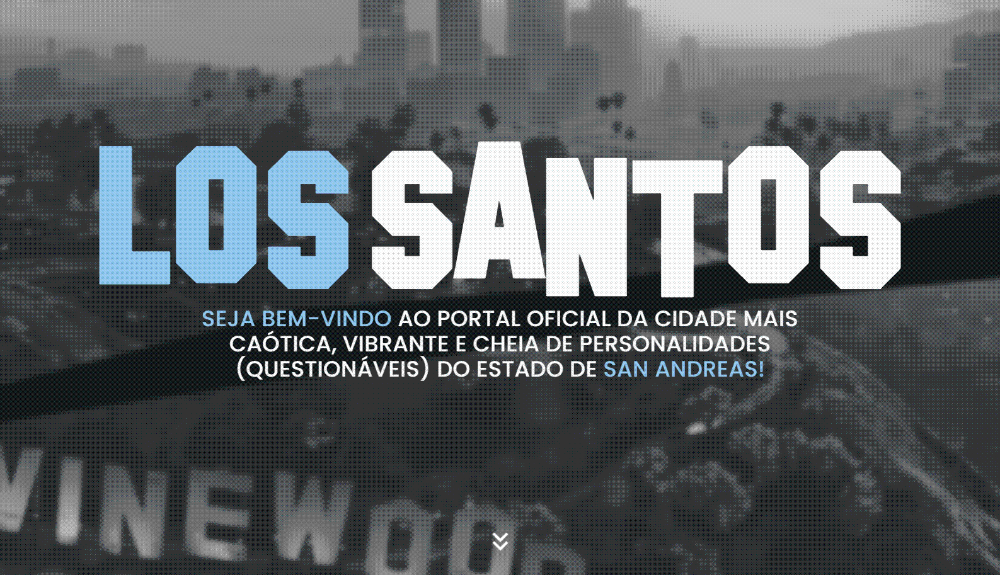

# Prefeitura de Los Santos | Landing Page
### Acesse todos os serviços disponíveis no portal oficial da cidade de los santos, como informações de contato, dados tributários e programas beneficente.

---
    1 - Home: Seção inicial com título, subtítulo e seta animada (arrowDown).

    2 - Mobile: Título e anúncio do patrocinador. Fornece informações sobre o aplicativo mobile, possibilitando acesso ao portal da cidade pelo celular. Inclui uma composição de um celular feita com JavaScript que mostra informações ao clicar nos ícones.

    3 - Programs: Fornece informações sobre programas e iniciativas realizadas na cidade. Inclui um (slider carrossel) mostrando imagens que ilustram esses programas.

    4 - Serviços Online: Mostra todas as informações possíveis de serem consultadas no portal, como: informações tributárias, emissão de documentos e uma área de feedback.

    5 - Guia da Cidade: Contém informações sobre pontos turísticos e gastronomia. | Inclui um (slider carrossel) mostrando imagens que ilustram os pontos turísticos.

    6 - Footer: Informações adicionais, isenção de responsabilidade e acesso a mídias sociais

---

---

# Processo

## 1 - Design
### Design e layout feito usando pacote Adobe 

- Obter referência e layout

- Escolher tema e obter assets

- Escolher cores

## 2 - Planejamento

- Fazer desenho de caixas (grid-flex) antes de escrever qualquer código, definindo quais elementos/tags serão usadas

## 3 - Código

### Arrow Down (Home Section)
- Foi implementada uma ArrowDown com animação de bounce usando CSS puro

---

    .arrow {
        animation: bouncing 1s infinite ease-in-out;
    }

    @keyframes bouncing {
    
        0% {
            bottom: 0;
        }

        50% {
            bottom: 30px;
        }

        100% {
            bottom: 0;
        }
    }

---

### Home Section
- Defini um h1 (title) e p (description)

Defini Display: flex; com flex-direction: column; e criei 5 containers (uma para cada tecnologia), defini um único container para todos os elementos para estilizar eles apenas uma vez (usando o mesmo container para todas as tecnologias, apenas adicionando mais uma classe para estilos individuais) 

## Projects (Projetos) Section

Novamente defini um container para ser usado para cada projeto para estilizar eles apenas uma vez, apenas mudando dados no HTML, abaixo do GIF eu defini um "p" para o título, foi usado font-awesome novamente no elemento repositório, um "anchor" foi definido com um link para o repositório no GitHub do determinado projeto, assim como o link para o GitHub Pages

:hovers foram adicionados nos elementos "Repositórios e GitHub Pages"

## Contact (Contato) Section

A seção Contato, assim como a "Hero" é composto apenas por texto e os ícones de mídia social (usei os mesmos estilos usados na "hero", mudando apenas a cor dos ícones e do :hover dos mesmos)

## Responsividade

Utilizei 4 break points

### 320px
- Tamanho usado para fazer o layout inicial (mobile-first)

### 440px
- Tamanhos de fontes da "hero page" foram alteradas para melhor visibilidade 
- Tamanho das imagens "GIF" foram alteradas para 95% da tela 

### 768px 
- Textos da "hero page" e "contact-page" foram alinhadas na esquerda
- Ícones da "hero page" e "contact-page" foram alinhadas na direita
- Textos novamente foram redimensionados para melhor visibilidade
- Project Page foi definida para flex-direction: column;
- A propriedade flex-wrap: wrap; foi definida para haver a quebra para segunda linha se a largura de um conjunto de elementos for maior que a área disponível em seu "container-parent" 
- Largura do container dos Projetos foram definidos para caberem apenas 2 em cada coluna 

### 1280px
- Todos os elementos foram escalados para melhor visibilidade

### Fazer versionamento quando;
- Html escrito
- Css escrito
- Clean code
- Ajuste de metadata e inserção de "Readme.md"

# Tecnologias utilizadas
- HTML5 Markup 
- CSS
- Clean Code
- Photoshop
- Illustrator
- Responsividade

# O que eu aprendi

#### CSS
- Usar wrap e elementos de larguras fixas para criar uma lista que quebra para uma segunda linha quando o tamanho de seu container pai for menor que esse tamanho

- Uso de Display: grid; para criar paginas que tenham várias seções uma abaixo da outra (como em uma landing page)

- Usar ícones da biblioteca do font-awesome

- Usar conceitos sólidos de responsividade como break points, e mudança de sentido de elementos com flex: column e row

# Dificuldades

Alinhamento vertical de texto "solucionado usando align-items: baseline;", quebra de elementos em resoluções menores por falta de responsividade 

---

# Autor
### Jefferson Augusto (a.k.a Benssssss) 
## [LinkedIn](https://www.linkedin.com/in/benssssss/)

## Projeto n.º6
